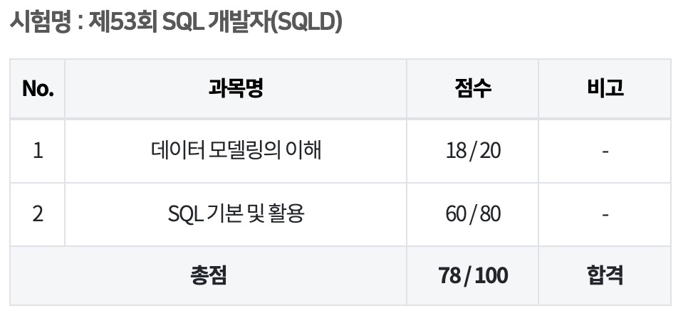

## SQLD란?

SQLD(Structured Query Language Developer) 시험은 데이터베이스 관련 업무를 수행하는 개발자에게 필요한 SQL 사용 능력을 검증하는 시험이다.

## 응시 계기

마지막 학기 데이터베이스 수업을 들으면서 SQL과 관련된 자격증이 있다는 것을 알게 되었다. 수업도 들을겸 겸사겸사 자격증도 같이 따면 좋을 거 같아 응시하게 됐다.

## SQLD 공부 방법

먼저 검색을 통해 SQLD 시험에 대한 정보를 찾아보았다.

합격한 사람들의 글의 공통점이 노랭이를 공부했다는 것이다.

개념 공부는 학교 공부와 홍쌤의 SQLD 강의를 들었다.

홍썜 강의는 유튜브에서 강의가 공개 되어 있고, 강의 교재도 네이버 카페 가입하면 받을 수 있었다.(2024년 5월 카페 공지로 강의 교재 유료 전환 공지가 올라왔다...)

[홍쌤 유튜브](https://www.youtube.com/@hdatalab)

그렇게 홍썜 무료 강의 + 노랭이 1회독 하고 시험을 쳤다.

결과적으로 말하자면 기출도 잘 찾아보면 복원 문제들이 있다고 한다.

개념 공부 + 노랭이 다회독 + 기출 복원 = 무적이라고 생각한다.

나는 시험을 치고 나서 기출 복원 문제가 있다는 것을 알게 됐고 후기들 중에서 기출에서 많이 나왔다고 한다.

그리고 노랭이를 풀다 보면 긴 sql 보기가 머리를 아프게 하는데 그런 문제는 풀면 좋겠지만 못풀어도 좌절하지 않아도 된다.

노랭이 자체가 SQLP 시험자도 보는 책이라서 아마 SQLP에서 나올만한 문제들이 긴 SQL 보기들로 된 문제였던 거 같다.

실제 시험에선 긴 SQL 보기가 나오지 않았다.

그리고 노랭이 문제와 똑같은 문제도 출제되었다.

## 시험 후기

시험 전날까지 개념과 노랭이 풀면서 100점 맞는 시험이 아니라 60점만 넘기면 되는 시험이다라고 생각하며 풀 수 있는 문제를 풀고 나오자라는 마인드로 시험을 보러 갔다.

생각보다 처음 보는 유형이 많았고, 보기의 길이는 짧았다.

50문제를 모두 풀고 검토까지 하고 나오는데 1시간 정도 걸렸다.

시험 본 느낌이 좋았고 다행히 합격도 하게 됐다.

