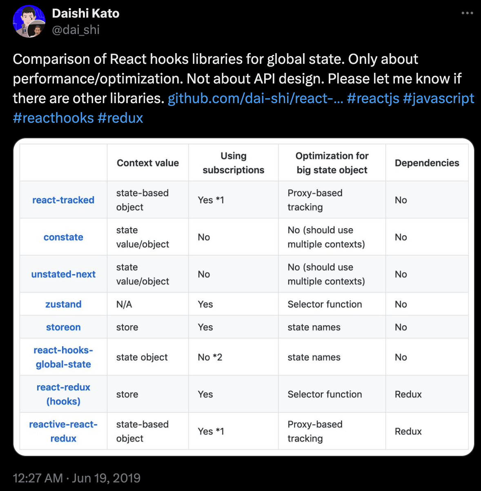

# Zustand(임시)

zustand 개발자 중 한명 인 Daishi Kato가 최근(240714) 블로그에 어떻게 zustand가 탄생하게 되었는지 글을 올렸다.

자신은 zustand v0가 생겨났을 때 React-Tracked를 개발하고 있었고, zustand의 제 2 저자라고 소개합니다.

그 당시 Dashi Kato의 신념은 React의 global state는 React Context를 통해 전달되어 React Concurrent Mode와 작동해야 한다고 생각했습니다.

2019년 당시 트위터로 그의 라이브러리(React-Tracked)와 다른 상태 관리 라이브러리의 비교 표를 트위터에 올렸었다.

임시페이지
